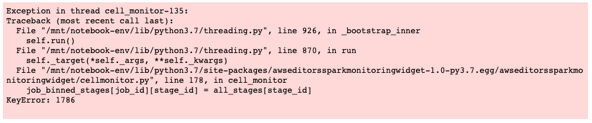

## Capstone Project
The goal of this project is to use [**Spark**](https://spark.apache.org/) to analize the log files collected from a fictitious music streaming service called "Sparkify" and identify a strategy to predict "churn", i.e. the event of a user cancelling the subscription with the service.

---
## Data
The data for this project was provided by Udacity in JSON format, in two differen sizes:

* A _Limited_ dataset (~128 MB, more than 280000 rows), to be used for analysis on a local machine. This is what I use in the [`Sparkify-project-local`](./notebooks/Sparkify-project-local.ipynb) notebook; the actual dataset can be downloaded from [here](https://drive.google.com/file/d/1gX1X-D8G4vE29AAUeQHapv5P_vNs6Jcv/view?usp=sharing).
* A _Complete_ dataset (~12 GB, more than 26 Mil rows), to be loaded on a cluster. This is what I explore in the [`Sparkify-project-EMR`](./notebooks/Sparkify-project-EMR.ipynb) notebook: it is stored in an [AWS S3](https://aws.amazon.com/s3/) bucket available at `s3n://udacity-dsnd/sparkify/sparkify_event_data.json`.

---
## Content of the notebooks
Both the notebook present the same table of contents; at a high level we have the following sections:

1. Load Libraries
2. [Load and Clean Dataset](#load-and-clean-dataset)
3. [Data Exploration](#data-exploration)
4. [Feature Engineering](#feature-engineering)
5. [Modeling](#modeling)
6. [Optimization](#optimization)

In the following we'll see details on all of them (except for the first one). I will mostly make reference to the `local` notebook, clarifying when I show results from the `EMR` one as I go.

Finally, a [Conclusions](#Conclusions) section will summarize the results and possible improvement strategies.

### Load and Clean Dataset
This part is fairly similar for both the local and EMR cases; the first operation is to load the JSON file:

```
  # Load data
  <Path defined accordingly>
  df_user_log = spark.read.json(path)
```

After that we can look at the schema of the loaded data frame:

```
  # Check schema
  df_user_log.printSchema()
```
```
root
 |-- artist: string (nullable = true)
 |-- auth: string (nullable = true)
 |-- firstName: string (nullable = true)
 |-- gender: string (nullable = true)
 |-- itemInSession: long (nullable = true)
 |-- lastName: string (nullable = true)
 |-- length: double (nullable = true)
 |-- level: string (nullable = true)
 |-- location: string (nullable = true)
 |-- method: string (nullable = true)
 |-- page: string (nullable = true)
 |-- registration: long (nullable = true)
 |-- sessionId: long (nullable = true)
 |-- song: string (nullable = true)
 |-- status: long (nullable = true)
 |-- ts: long (nullable = true)
 |-- userAgent: string (nullable = true)
 |-- userId: string (nullable = true)
```

We can check an example of the data extracting the first row:

```
  # Show the first row
  df_user_log.head()
```
```
Row(artist='Martha Tilston', auth='Logged In', firstName='Colin', gender='M', itemInSession=50, lastName='Freeman', length=277.89016, level='paid', location='Bakersfield, CA', method='PUT', page='NextSong', registration=1538173362000, sessionId=29, song='Rockpools', status=200, ts=1538352117000, userAgent='Mozilla/5.0 (Windows NT 6.1; WOW64; rv:31.0) Gecko/20100101 Firefox/31.0', userId='30')
```

It's also possible to check the number of rows and columns in the dataset. Here, of course, we could see the difference between the limited dataset and the full one:

```
  # Check num of rows, columns
  print('Num. of rows in the dataset: ', df_user_log.count(), '; Num. of columns: ', len(df_user_log.columns))
```

_Limited Dataset_
```
Num. of rows in the dataset:  286500 ; Num. of columns:  18
```

_Complete Dataset_
```
Number of rows in the dataset:  26259199 ; Number of columns:  18
```

In terms of cleaning, what I did is I got rid of rows with:

* Any `NaN` eventually present in the `sessionId` or `userId` fields: this could have been the consequence of errors or bugs in the logging system;
* Any `Nan` eventually present in the `gender` or `location` fields: I use these in part of the exploration phase, to look at demographics;
* Any empty `userId` field still remaining: this would be most likely associated with events like the very first interaction of the users with the system.

```
  # Drop NaN in userId and sessionId
  df_user_log_valid = df_user_log.dropna(how = "any", subset = ["userId", "sessionId"])

  # Drop NaN in gender and location
  df_user_log_valid = df_user_log.dropna(how = "any", subset = ["gender", "location"])

  # Drop empty users
  df_user_log_valid = df_user_log_valid.filter(df_user_log_valid["userId"] != "")
```

We can then check the number of remaining rows:

```
  # Check num of rows remaining
  print('Num. of rows in the valid dataset: ', df_user_log_valid.count())
```

_Limited Dataset_
```
  Num. of rows in the valid dataset:  278154
```

_Complete Dataset_
```
  Num. of rows in the valid dataset:  25480720
```

### Data Exploration
Looking at the dataset schema, a column seeming to provide quite a bit of useful information is `page`, that documents the various pages visited by the users:

```
  # Check available pages
  df_user_log_valid.select("page").dropDuplicates().sort("page").show()
```
```
+--------------------+
|                page|
+--------------------+
|               About|
|          Add Friend|
|     Add to Playlist|
|              Cancel|
|Cancellation Conf...|
|           Downgrade|
|               Error|
|                Help|
|                Home|
|              Logout|
|            NextSong|
|         Roll Advert|
|       Save Settings|
|            Settings|
|    Submit Downgrade|
|      Submit Upgrade|
|         Thumbs Down|
|           Thumbs Up|
|             Upgrade|
+--------------------+
```

Based on the information available in this column, we can define new variables identifying, for example, an actual churn (looking at when the users visits `Cancellation Confirmation`) or an `Upgrade`/`Downgrade`, but also events like the user giving a Thumbs Up or adding friends, or seeing a Rolling Advert.  
It would also be possible to reconstruct the time spent by the users with the system, making reference to the `registration` and `ts` columns.

Starting from these ideas I decided to modify the dataset:

* Introducing a `churn` column based on whether or not the user visits the `Cancellation Confirmation` page;
* Introducing a `sub_dwg` column based on whether or not the user visits the `Submit Downgrade` page;
* Introducing a `sub_upg` column based on whether or not the user visits the `Submit Upgrade` page;
* Converting the UNIX time in `ts` and `registration` from ms to s, for simplicity;
* Introducing a `first_ts` and a `last_ts` column showing the timestamp of the first/last entry for a user;
* Introducing a `perm_days` column showing the (rounded) number of days a user has spent with the service so far;
* Introducing a `data_days` variable showing the (rounded) number of days of data available for a user;
* Introducing a `roll_adv` column based on whether or not the user visits the `Rolled Advert` page;
* Introducing a `total_rolled_advert` column showing the total of the roll advert events per user;
* Introducing an `add_friend` column based on whether or not the user visits the `Add Friend` page;
* Introducing a `total_add_friend` column showing the total of the friends added per user;
* Introducing an `thumbs_up` column based on whether or not the user visits the `Thumbs Up` page;
* Introducing a `total_thumbs_up` column showing the total of the thumbs up given per user;
* Introducing an `thumbs_dwn` column based on whether or not the user visits the `Thumbs Down` page;
* Introducing a `total_thumbs_dwn` column showing the total of the thumbs down given per user;

Once introduced all the columns above we can take a look at the data:

```
  # Check columns
  df_user_log_valid.head()
```
```
Row(artist='Sleeping With Sirens', auth='Logged In', firstName='Darianna', gender='F', itemInSession=0, lastName='Carpenter', length=202.97098, level='free', location='Bridgeport-Stamford-Norwalk, CT', method='PUT', page='NextSong', registration=1538016340.0, sessionId=31, song='Captain Tyin Knots VS Mr Walkway (No Way)', status=200, ts=1539003534.0, userAgent='"Mozilla/5.0 (iPhone; CPU iPhone OS 7_1_2 like Mac OS X) AppleWebKit/537.51.2 (KHTML, like Gecko) Version/7.0 Mobile/11D257 Safari/9537.53"', userId='100010', churn=0, sub_dwg=0, sub_upg=0, first_ts=1539003534.0, last_ts=1542823952.0, perm_days=56.0, data_days=44.0, roll_adv=0, total_roll_adv=52, add_friend=0, total_add_friend=4, thumbs_up=0, total_thumbs_up=17, thumbs_dwn=0, total_thumbs_dwn=5)
```

After that, I took few more actions on the data set:

* To gain significance in the data, I filtered away all the users with less than a week of data;
* I created a list of the churning users and a list of the users that are staying with the service. Based on those lists I divided the original data set in two: a portion for the users that leave and another for those that don't. Data from these data sets will then be compared, looking for patterns;
* I also further refined the two previous datasets, extracting a subset from each, containing the last week of data for every user. The idea was to look for patterns of different behaviour in the churning users, as they approach the moment they leave.

Once done all of that, it became possible to compare the dataset including the users that left and the one with the users that stay.  
Both the [`Sparkify-project-local`](./notebooks/Sparkify-project-local.ipynb) and [`Sparkify-project-EMR`](./notebooks/Sparkify-project-EMR.ipynb) notebooks show details of these comparisons for different variables: here in the follow I will show some pictures and statistics relative to some of the more interesting features. I will make reference here to the **Global** dataset (hence the `EMR` notebook). 

#### _Time spent by the Users with the Service_

<p align="center">
  
</p>

```
------------------------------------------------
Time spent statistics for users that cancelled:
Mean =  69.69 ; Std. Dev. =  40.74
------------------------------------------------
Time spent statistics for users that stay:
Mean =  86.45 ; Std. Dev. =  39.59
------------------------------------------------
```

#### _Songs listened per day_

<p align="center">
  
</p>

```
---------------------------------------------------
Songs per day statistics for users that cancelled:
Mean =  33.40 ; Std. Dev. =  26.71
---------------------------------------------------
Songs per day statistics for users that stay:
Mean =  20.21 ; Std. Dev. =  19.17
---------------------------------------------------
```

#### _Friends added per day_

<p align="center">
  
</p>

```
---------------------------------------------------------
Added friend per day statistics for users that cancelled:
Mean =  0.68 ; Std. Dev. =  0.61
---------------------------------------------------------
Added friend per day statistics for users that stay:
Mean =  0.41 ; Std. Dev. =  0.44
---------------------------------------------------------
```

#### _Thumds Down given per day_

<p align="center">
  
</p>

```
--------------------------------------------------------------
Thumbs down given per day statistics for users that cancelled:
Mean =  0.48 ; Std. Dev. =  0.43
--------------------------------------------------------------
Thumbs down per day statistics for users that stay:
Mean =  0.27 ; Std. Dev. =  0.29
--------------------------------------------------------------
```

#### _Rolled Advert per day_

<p align="center">
  
</p>

```
----------------------------------------------------------
Rolled adverts per day statistics for users that cancelled:
Mean =  0.92 ; Std. Dev. =  1.13
----------------------------------------------------------
Rolled adverts per day statistics for users that stay:
Mean =  0.46 ; Std. Dev. =  0.64
----------------------------------------------------------
```

Beyond the behavioural quantities I also took a look at some deomgraphic indicators: gender of the subscriber and location (expressed in terms of State).

#### _Gender of the Users_

```
-----------------------------------------------------------------------------
Gender distribution for users that cancelled:
Number of male users =  2123
Number of female users =  1848
Number of male users/Total Users =  0.53
Number of female users/Total Users =  0.47
-----------------------------------------------------------------------------
Gender distribution for users that stay:
Number of male users =  10641
Number of female users =  9662
Number of male users/Total Users =  0.52
Number of female users/Total Users =  0.48
-----------------------------------------------------------------------------
```

#### _Location of the Users_

<p align="center">
  
</p>

<p align="center">
  
</p>

### Feature Engineering
Based on the data analysis completed in the previous section, I decided to consider as training features to be used for the modeling phase:

* The number of rolled adverts/day
* The number of friends added/day
* The number of thumbs down given/day
* The number of songs listened/day
* The time spent with the service

The label will be the actual churning event.

I couldn't see any evidence of a significant difference in the behaviour of the users in the last week before churning vs. the behaviour before, so I resolved to consider their full history. Analogously, I couldn't see a meaningful difference between the groups in terms of gender or location, so I ended up not including demographics information.

All the features are grouped by userId. An example of the dataset format after the feature engineering phase is:

```
  # Check the data
  df_user_logs_mod.head()
```
```
Row(id='100010', rolledAdvDay=1.1818181818181819, addedFriendDay=0.09090909090909091, thumbsDwnDay=0.022727272727272728, songsDay=6.113636363636363, permanence=56.0, label=0)
```

### Modeling
In this section, I compared a few of the classifiers available in [Spark](https://spark.apache.org/docs/latest/ml-classification-regression.html), considering, for all of them, their reference parameters (i.e., I did not run any grid optimization here). I chose:

* A [Logistic Regression](https://spark.apache.org/docs/latest/ml-classification-regression.html#logistic-regression) classifier;
* A [Gradient Boosted Tree](https://spark.apache.org/docs/latest/ml-classification-regression.html#gradient-boosted-tree-classifier) classifier;
* A [Random Forest](https://spark.apache.org/docs/latest/ml-classification-regression.html#random-forest-classifier) classifier;
* A [Linear Support Vector](https://spark.apache.org/docs/latest/ml-classification-regression.html#linear-support-vector-machine) classifier.

In terms of phases:

* The first thing was splitting the dataset in train and testing portions (note: fixing the seed here ensures repeatability of the experiment):

```
  # 80/20 % split
  train, test = df_user_logs_mod.randomSplit([0.8, 0.2], seed=42)
```

* Then I defined a [VectorAssembler](https://spark.apache.org/docs/latest/ml-features#vectorassembler) to combine all the features of interest in a single vector:

```
  # Define VectorAssembler
  assembler = VectorAssembler(inputCols=["rolledAdvDay",\
                                       "addedFriendDay",\
                                       "thumbsDwnDay",\
                                       "songsDay",\
                                       "permanence"], \
                            outputCol="inputFeatures")
```

* I then scaled the data using a [Min-Max Scaler](https://spark.apache.org/docs/latest/ml-features#minmaxscaler). I opted for this given that the distributions of the various features (as seen in the data exploration section) are quite skewed and far from resembling the normal one.

```
  # Define Scaler
  scaler = MinMaxScaler(inputCol="inputFeatures", outputCol="features")
```

* After that, I could introduce 4 [pipelines](https://spark.apache.org/docs/latest/ml-pipeline.html), one for each of the classifiers:

```
  # Classifiers/Pipelines

  # Logistic Regression 
  lr = LogisticRegression()
  pipeline_lr = Pipeline(stages = [assembler, scaler, lr])

  # Gradient-Boosted Tree classifier
  gbt = GBTClassifier()
  pipeline_gbt = Pipeline(stages = [assembler, scaler, gbt])

  # Random Forest classifier
  # Note: setting the seed will ensure repeatability of the results
  rf = RandomForestClassifier(seed = 42)
  pipeline_rf = Pipeline(stages = [assembler, scaler, rf])

  # Linear Support Vector Machine classifier
  lsvc = LinearSVC()
  pipeline_svc = Pipeline(stages = [assembler, scaler, lsvc])
```

* Finally, I opted for a validator using the f1-score metric, given the [imbalance in the data](https://stats.stackexchange.com/questions/210700/how-to-choose-between-roc-auc-and-f1-score) (there are quite more users that stay that users that leave):

```
  # Evaluator - will be common for all the grids
  evaluator = MulticlassClassificationEvaluator(metricName="f1")
```

After that, I proceeded in fitting and evaluating the four classifiers.  
The most interesting thing in doing that, I believe, is the difference in results between the Limited and Complete dataset.

_Limited Dataset_
```
F1-score, Logistic Regression classifier:  0.8828
```
```
F1-score, Gradient-Boosted Tree classifier:  0.8190
```
```
F1-score, Random Forest classifier:  0.8095
```
```
F1-score, Linear Support Vector Machine classifier:  0.8302
```

_Complete Dataset_
```
F1-score, Logistic Regression classifier:  0.8398
```
```
F1-score, Gradient-Boosted Tree classifier:  0.8848
```
```
F1-score, Random Forest classifier:  0.8828
```
```
F1-score, Linear Support Vector Machine classifier:  0.8296
```

**NOTE**  
In proceeding with the fitting on the EMR cluster, I often received an exception similar to this:

<p align="center">
  
</p>

This was not always predictable or repeatable: the exception would generally happen during this phase, but not necessarily always at the same cell. Also, the body of the message might change slighlty, with `KeyError` making reference to different values. At any rate, the execution of the code could proceed after that, with no other noticeable effect.  
I found [this](https://stackoverflow.com/questions/58910023/keyerror-when-training-a-model-with-pyspark-ml-on-aws-emr-with-data-from-s3-buck) post on StackOverflow, describing a similar issue and advancing th hypothesis that the exception might in fact be related just to the Spark progress bar normally shown. However, I couldn't gather any further insight.

### Optimization
Once fitted the classifiers with the default parameters, I proceeded with an optimization for the Gradient Boosted Tree and Random Forest cases. I defined the following grids:

```
  # Gradient Boosted Tree 
  # Parameter grid
  paramgrid_gbt_o = ParamGridBuilder()\
      .addGrid(gbt.stepSize, [0.1, 0.25, 0.5])\
     .addGrid(gbt.maxIter, [20, 40, 60])\
     .build()
```
```
  # Random Forest
  # Parameter grid
  paramgrid_rf_o = ParamGridBuilder()\
      .addGrid(rf.impurity, ['entropy', 'gini'])\
     .addGrid(rf.maxDepth, [5, 10])\
     .addGrid(rf.numTrees, [20, 40])\
     .build()
```

Obtaining, in both cases, some improvement in the score:

_Limited Dataset_
```
F1-score, Gradient-Boosted Tree classifier:  0.8401
```
```
F1-score, Random Forest classifier:  0.8302
```

_Complete Dataset_
```
F1-score, Gradient-Boosted Tree classifier:  0.8859
```
```
F1-score, Random Forest classifier:  0.8850
```

---
## Conclusions 
With this  project I demonstrated the possibility to train a classifier to predict, based on available information, whether or not a user of the "Sparkify" service will "churn" with a level of performance measured by an **f1-score > 0.8**.

There are a few things that I found particularly interesting in going through the experience:

* First of all, the general saying that the majority of the time in Data Science is spent doing data exploration and feature engineering is absolutely true. I would say that at least 75% of the time I spent on the project went into these two phases, and it probably could have been more.
* The actual modeling phase highlighted the differences, and added value, of the Complete data set vs. the Limited one. Indeed, while in fitting against the Limited data some classifiers (Logistic Regression and SVC) were scoring higher f1 than the others, the positions switched when evaluating against the Complete dataset. In that case, the Gradient Boosted Tree and Random Forest classifiers scored better both in relative and absolute sense.
* The results could be improved even further through a grid optimization phase that led to a final **f1-score of ~0.89**. However, the grid parameters chosen in these project should not be considered exhaustive: indeed, it would be a possible option for further improvements to explore how to get an even better score.
